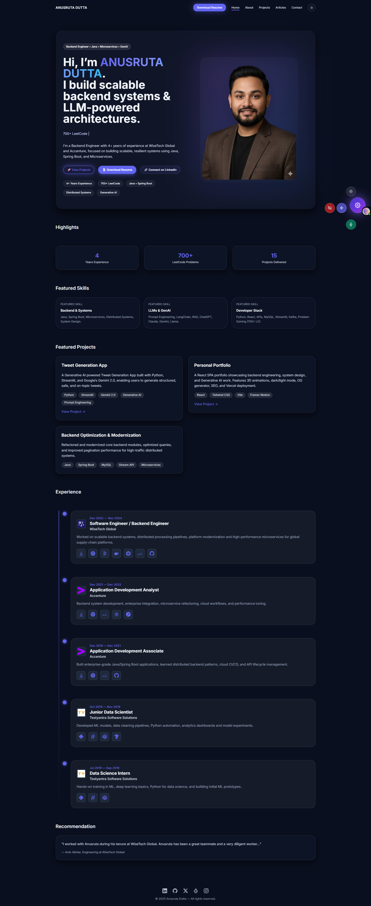

# 🌐 Anusruta Dutta – Personal Portfolio

A modern, high-performance, fully responsive **developer portfolio** built using **React, Vite, TailwindCSS, Framer-Motion**, and **Three.js**.

This portfolio showcases my expertise as a **Backend Engineer (Java)**, along with my professional projects, technical skills, achievements, and experience in **Microservices, Spring Boot, Distributed Systems, and Generative AI**.

The site features a premium UI with **glassmorphism effects**, **advanced animations**, **3D interactions**, and a personalized settings panel.

---

## 🚀 Live Demo

| Domain | Status |
|--------|--------|
| **Production** | https://www.anusrutadutta.com |
| **Root Redirect** | https://anusrutadutta.com → www |
| **Vercel Backup URL** | https://anusruta-portfolio.vercel.app |

---

## ✨ Features

### 🎨 UI & Visuals
- Smooth glassmorphic layout  
- Parallax layers for depth  
- Floating animated hero image  
- 3D hover tilt effect  
- Gradient text animations  
- Typewriter dynamic headline  
- Interactive badges and CTAs  
- Light & Dark mode support  
- Customizable Settings Panel  

### 👤 Hero Section
Includes:
- Floating portrait with glow aura  
- Motion-based 3D tilt  
- Premium lighting & blur effects  
- Dynamic animated headline  
- Typewriter rotating skills  
- Resume + LinkedIn + Projects buttons  

### 🧰 Technologies Used
- **React 18**
- **Vite**
- **TailwindCSS**
- **Framer Motion**
- **Zustand** (preferences state)
- **React Three Fiber / Drei**
- **React Markdown**
- **Vercel Edge Deployment**

---

## 🧩 Tech Stack (Badges)


---

## 📸 Screenshots

### 🏠 Home Page

Add a screenshot image here:
Then reference it like:



---

## 🛠 Running Locally

### 1️⃣ Clone the repository
```bash
git clone https://github.com/AnusrutaD/anusruta-portfolio.git
cd anusruta-portfolio
```

### 2️⃣ Install dependencies
```bash
yarn install
# or
npm install
```

### 3️⃣ Start development server
```bash
yarn dev
# or
npm run dev
```

### 4️⃣ Build for production
```bash
yarn build
# or
npm run build
```

---

## 🚀 Deployment (Vercel)

This project is deployed using **Vercel**.

**Build Command**
```
npm run build
```

**Output Directory**
```
dist
```

Vercel automatically provides:
- Global CDN  
- HTTPS certificates  
- Edge caching  
- Zero-downtime deployments  

---

## 🔒 Domain Configuration (Hostinger → Vercel)

### ✔ A Records  
```
@ → 76.76.21.21
@ → 76.223.126.88
```

### ✔ CNAME  
```
www → <your-vercel-cname>.vercel-dns-o17.com
```

Root domain (`anusrutadutta.com`) redirects to:
```
https://www.anusrutadutta.com
```

---

## 🔧 Settings Panel (Zustand)

The site includes a modern settings panel allowing users to toggle:

- Dark/Light mode  
- Particle background  
- 3D tilt motion  
- Floating animation  

Preferences persist via:
```
localStorage → anusruta-prefs
```

---

## 📈 Performance & SEO

- Highly optimized Vite build  
- Minified bundles  
- Lazy-loaded heavy components  
- SEO metadata included  
- Mobile-first responsive UI  
- Smooth animations at 60fps  

---

## 🧑‍💻 About Me

**Anusruta Dutta**  
Backend Engineer | Java | Microservices | System Design | Generative AI  

- 4+ years of industry experience  
- Worked with Wipro Global & Accenture  
- 700+ LeetCode problems solved  
- Strong in backend architecture and scalable systems  

**Connect with me:**  
🔗 LinkedIn — https://www.linkedin.com/in/anusrutadutta  
📧 Email — anusrutadutta97@gmail.com  

---

## ⭐ Support the Project

If you like this portfolio:
```
⭐ Please give the repository a star!
```

---

## 📜 License
```
MIT License © Anusruta Dutta
```
